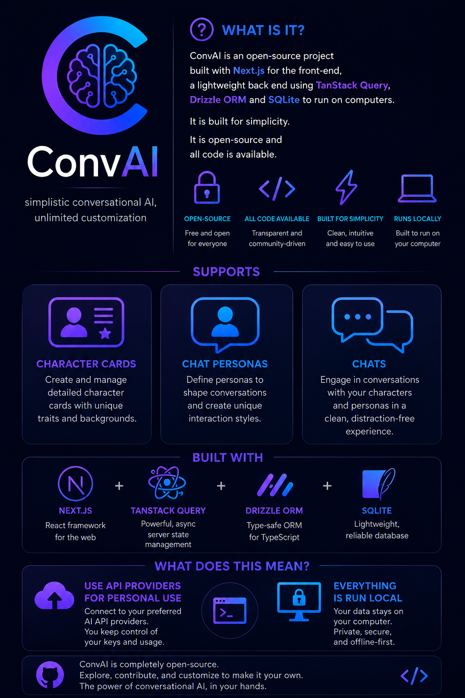

# ConvAI


**Version: Alpha 0.0.1**


An open-source chat front-end that is simplified for many users. ConvAI provides a streamlined interface for conversational AI interactions with a focus on character and scenario-based roleplay.

> ⚠️ **Early Development Notice**: This is a very early alpha build. Expect bugs, missing features, and significant changes. Quality of life improvements and major features are planned for future releases.

## 🔒 Privacy & Local-First

- **SQLite Database**: All data is stored locally using SQLite
- **Complete Privacy**: No cloud sync, no telemetry - everything stays on your machine
- **Local File Storage**: Characters, personas, and uploads are stored in your workspace

## ✨ Current Features

- ✅ **Character Management**: Create, edit, and manage AI characters with custom personalities, greetings, and scenarios
- ✅ **Persona System**: Define user personas with custom descriptions and avatars
- ✅ **Chat Interface**: Full conversational interface with message history
- ✅ **Multi-Provider Support**: Configure multiple AI providers (OpenAI-compatible APIs)
- ✅ **API Key Management**: Securely store and manage API keys for different providers
- ✅ **Model Configuration**: Add and configure different AI models with custom settings
- ✅ **Interference Profiles**: Fine-tune AI responses with temperature, top-k, top-p, and token limits
- ✅ **Image Support**: Upload and display images for characters and personas
- ✅ **Theme Support**: Dark and light mode themes

## 🚧 Known Limitations

- ❌ **No Lorebook Support**: World info and lore management not yet implemented
- ❌ **No Group Chats**: Only 1-on-1 conversations are currently supported
- ❌ **No Message Editing**: Cannot edit or regenerate individual messages yet

## 🗺️ Roadmap

### Near Future

- [ ] **Delete/Update Characters & Personas**: Right now it is not fully implemented yet
- [ ] **Delete/Update Message**: To allow the removal of stuff
- [ ] **Continue Message**: Extend AI responses that were cut off
- [ ] **Refresh/Regenerate Message**: Regenerate the last AI response
- [ ] **Better UI**: Improved user interface and user experience

### Far Future

- [ ] **Lorebook Support**: Add world info, character books, and memory management
- [ ] **Group Chat**: Support for multi-character conversations

## 🚀 Getting Started

### Prerequisites

- Node.js 20 or higher
- npm or pnpm

### Installation

1. Clone the repository

```bash
git clone https://github.com/DecaDevelops/convai
cd convai
```

2. Install dependencies

```bash
npm install
```

3. Run the development server

```bash
npx -y drizzle-kit push
npm run dev
```

4. Open [http://localhost:3000](http://localhost:3000) in your browser

### Setup

1. **Add an API Key**: Navigate to API Keys and add your OpenAI-compatible API key
2. **Create a Provider**: Set up a provider with the API endpoint and link your API key
3. **Add a Model**: Configure a model from your provider
4. **Create an Interference Profile**: Set up response parameters (temperature, token limits, etc.)
5. **Create a Character**: Design your first AI character
6. **Start Chatting**: Create a new chat and select your character

## 🛠️ Tech Stack

- **Framework**: Next.js 16 with React 19
- **Database**: SQLite with Drizzle ORM
- **UI**: Shadcn/ui components with Tailwind CSS
- **State Management**: TanStack Query (React Query)
- **AI Integration**: OpenAI SDK (compatible with multiple providers)

## 📁 Project Structure

```
src/
├── app/              # Next.js app router pages
├── components/       # Reusable UI components
├── features/         # Feature-specific modules (characters, chats, etc.)
├── data/            # Database schema and migrations
├── lib/             # Utility functions and helpers
└── hooks/           # Custom React hooks
```

## 🤝 Contributing

This is an early alpha project. Contributions, issues, and feature requests are welcome!

## 📝 License

[Add your license here]

## 🙏 Acknowledgments

Built with modern web technologies and a focus on user privacy and local-first data management.

---

**Note**: This project is in active development. Features and APIs may change significantly between releases.

# Social

## Join the discord

[Discord](https://discord.gg/3KjsGcRHvc)
